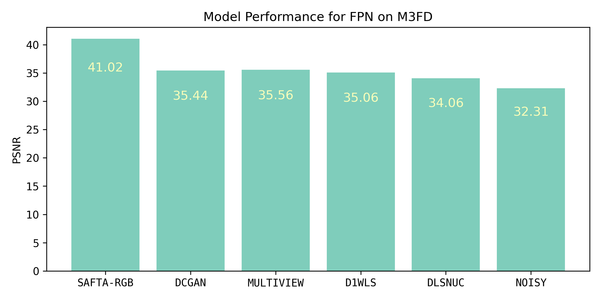
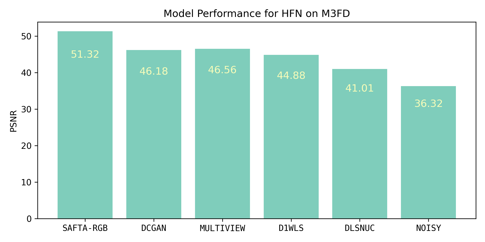

# RGB-Guided Infrared Fixed-Pattern Noise Estimation via Sequential Adaptive Fusion

SAFTA is a deep learning framework for infrared image denoising guided by RGB-derived infrared estimates. Given a noisy infrared image and its corresponding RGB image, SAFTA first predicts a clean infrared estimate using a convolutional network that leverages spatial features from the RGB modality. This estimated infrared image is then used as a guidance signal to refine the noisy infrared input through a series of convolutional feature transformations.

To handle structured fixed pattern noise (FPN), SAFTA incorporates a recurrent estimation module based on a GRU cell. This module receives a sequence of noisy and estimated clean infrared image pairs, updating the FPN parameters incrementally at each step. By combining RGB-guided spatial denoising with temporally-aware noise modeling, SAFTA delivers effective correction across both high- and low-frequency non-uniformities in thermal images.

## Algorithm Performance

In our paper, we evaluate denoising performance under two distinct synthetic noise settings: FPN and HFN. The FPN setting represents the complete fixed pattern noise model, incorporating both vertical stripe noise and low-frequency shading effects (commonly referred to as narcissism). This combination simulates the full extent of non-uniformities typically encountered in thermal cameras. The results under FPN conditions presented in the following figure.

 

In contrast, the HFN setting isolates only the high-frequency stripe noise component by setting the gain of the low-frequency noise to zero. This allows us to assess the model's ability to correct structured vertical artifacts without the additional complexity of broader shading patterns. The results under HFN conditions, presented in the following figure, show a significant performance boost compared to full FPN, highlighting the additional complexity introduced by low-frequency artifacts in the denoising task.

The results, presented in figures, demonstrate that RGB guidance consistently improves denoising performance in both stages and across both noise types. However, the improvements are more pronounced under FPN conditions, where the additional structural cues from the RGB image help the network disentangle more complex noise patterns.